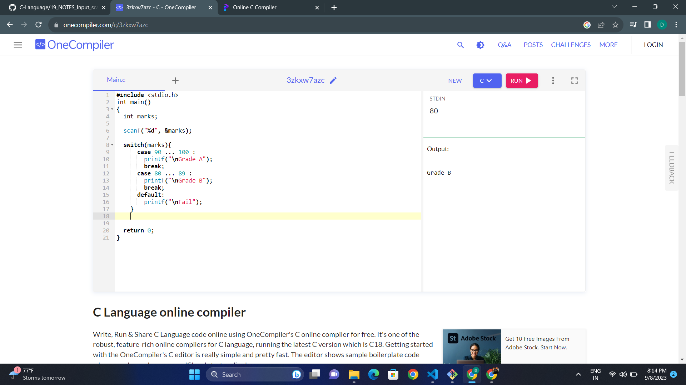

## Datatypes - 02

### 1. Int
- `Range of signed` = -2147483648 to 2147483647
- `Range of unsigned` = 0 to 4294967295
- If in Signed:
    - If in signed we enter a number greater than or lesser than the range, the output will be according to the cycle.
    - int n1 = 2147483647  | o/p : 2147483647
    - int n2 = 2147483648  | o/p : -2147483648
    - int n3 = 2147483649  | o/p : 2147483647
    - int n4 = -2147483648 | o/p : -2147483648
    - int n1 = -2147483649 | o/p : 2147483647

    