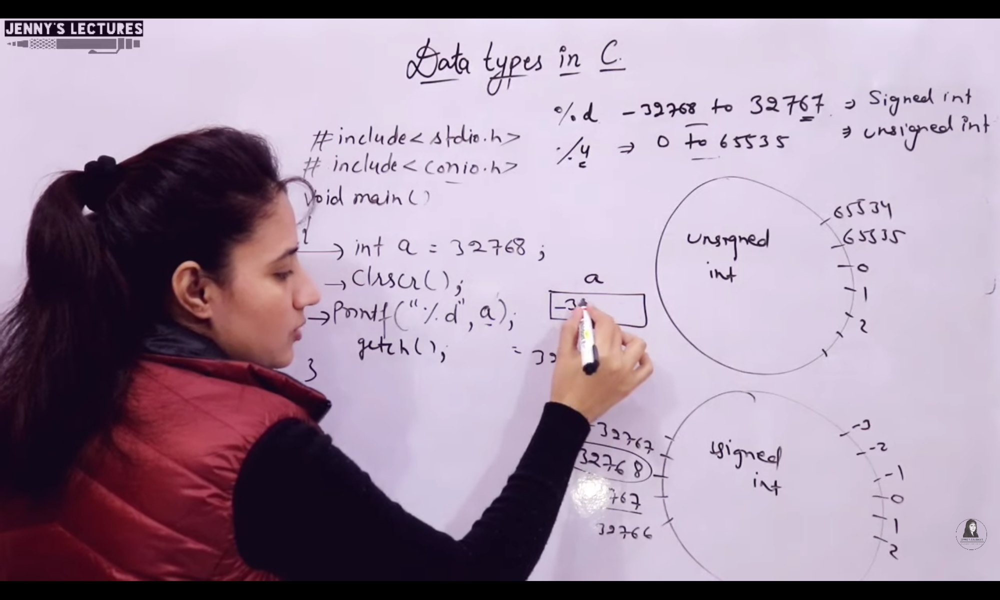

## Datatypes - 02

### 1. Int
- `Range of signed` = -2147483648 to 2147483647
- `Range of unsigned` = 0 to 4294967295
- `%u` leads to unsigned circle
- `%d` leads to signed circle
- If in Signed:
    - If in signed we enter a number greater than or lesser than the range, the output will be according to the cycles.
    - int n1 = 2147483647  | printf("%d", n1) | o/p : 2147483647
    - int n2 = 2147483648  | printf("%d", n2) | o/p : -2147483648
    - int n3 = 2147483649  | printf("%d", n3) | o/p : 2147483647
    - int n4 = -2147483648 | printf("%d", n4) | o/p : -2147483648
    - int n5 = -2147483649 | printf("%d", n5) | o/p : 2147483647

    - int n6 = -2147483648 | printf(`"%u"`, n6) | o/p : 2147483648
    - int n7 = -2          | printf(`"%u"`, n7) | o/p : 4294967294

    