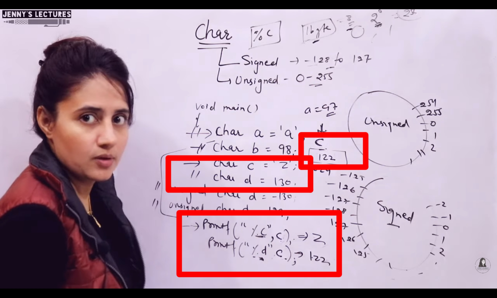
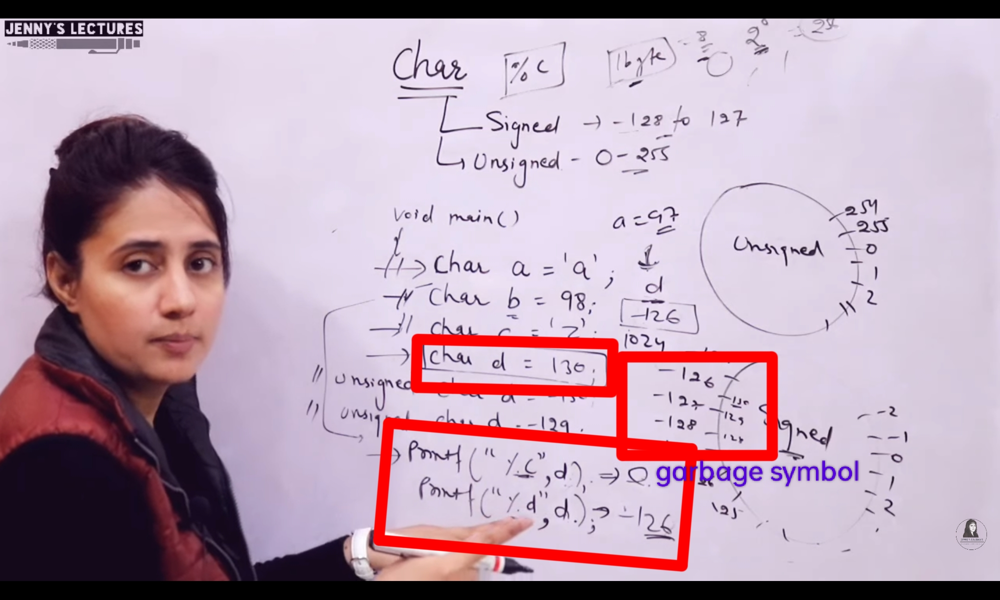

## Datatypes - 3

### 1. Char
- Size : 1 byte
- `Range` : -128 to 127 | Signed
- `Range` : 0 to 255 | Unsigned
- `Format Specifier` : %c
- Every code needs to be converted into Binary form, to be stored in memory
- `Character System` is used to store code(English Language) in memory after converison to binary
    - Ex: ASCII

---

