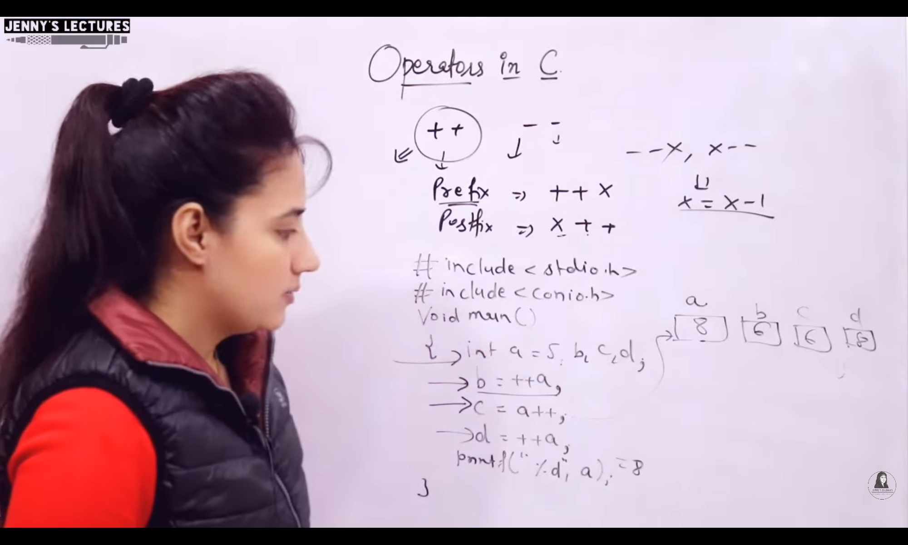

## Operators - 2
- Types of `operators` based on `operations`:
    - Arithmetic
    - Assignment
    - ++ and --
    - Logical
    - Relational
    - Bitwise
    - Special

---
 
### Arithmetic
- `%` Modulo 
- It cannot be used with floating points
- Answer will be acc. to positive numerator and denominator
- Sign will be according to numerator
- int n1 = -10 | int n2 = 7 | printf("%d", n1%n2);
    - o/p : -3
- int n1 = 10 | int n2 = -7 | printf("%d", n1%n2);
    - o/p : 3 {Always depends on numerator}
- int n1 = -10 | int n2 = -7 | printf("%d", n1%n2);
    - o/p : -3

`Arithmetic`
- float n1 = 10 | float n2 = 7 | printf("%d", n2+n1) | o/p : Garbage Value
- int n1 = 10 | float n2 = 7 | printf("%d", n2+n1) | o/p : Garbage Value
- If even one operand is `float`, output will be generated using `%f` format specifier

---

### Assignment
- Left to Right
- a = b = c = d = 10
- (a = (b = (c = (d = 10))))
- a = a + 1 | a += 1 

---

### Prefix & Postfix

