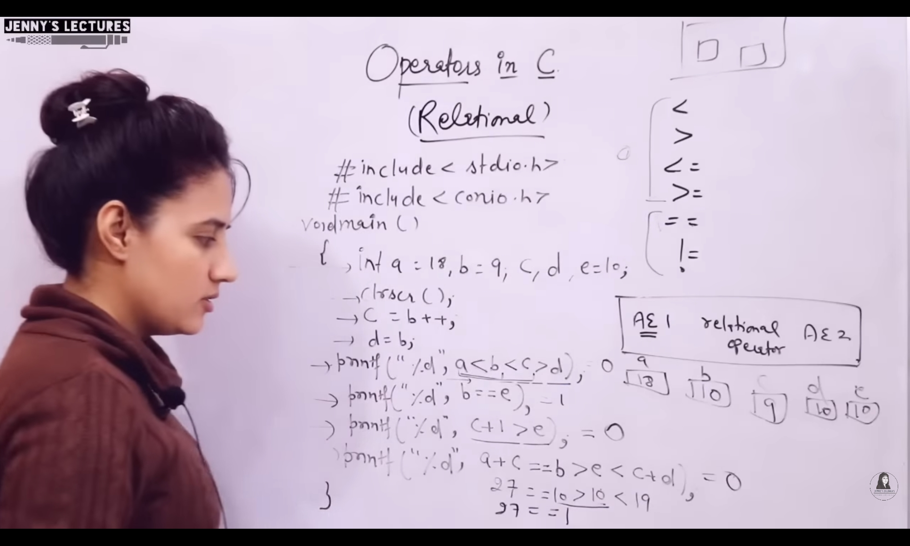

### Relational Operators
- Output is either `True` or `False`
- `True` = 1
- `False` = 0
- Can be used to compare:
    - int
    - float
    - char
    - string:
        - In case of strings, `addresses` will be `compared` of first character
- Associativity is Left to Right
- a<b<c>d = (((a<b)<c)>d)
- Equality operators have `lower` precedence than relational. Relational will be computed first, then equality

