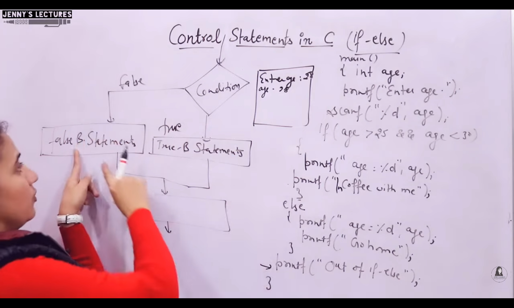
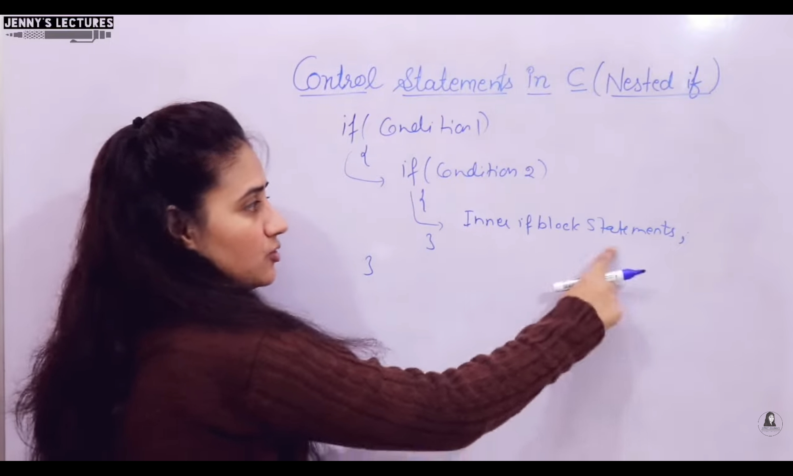
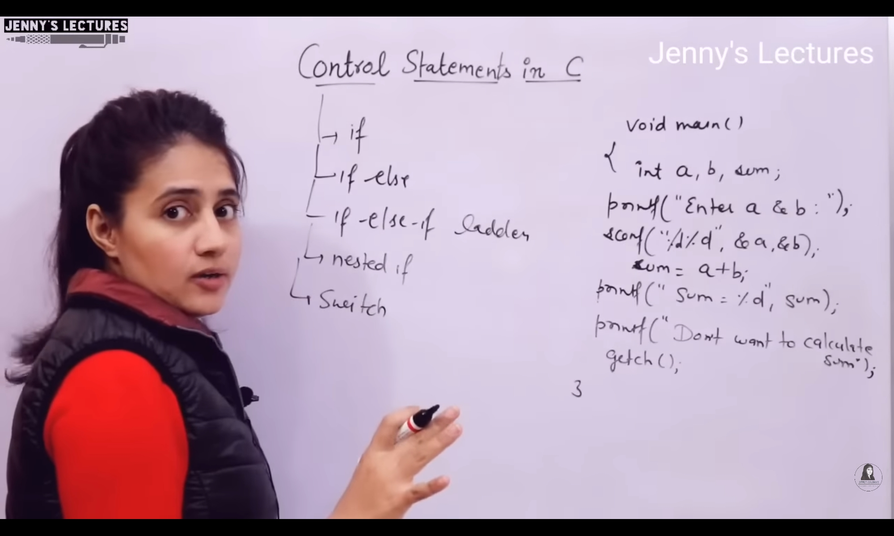
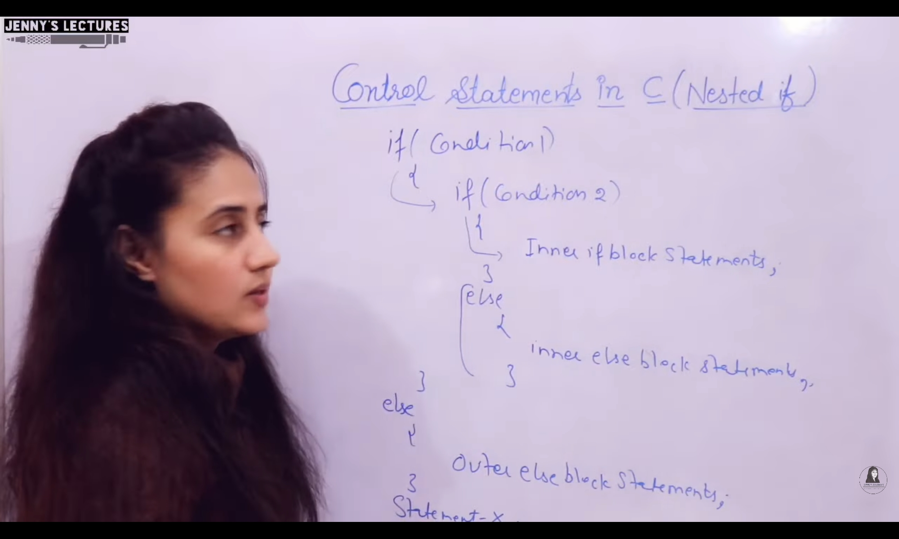
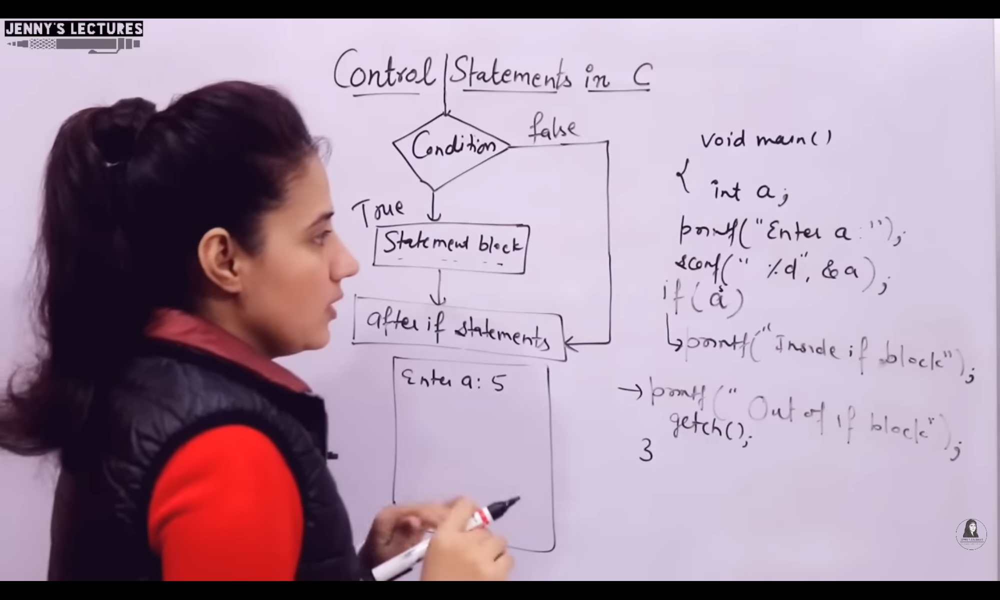
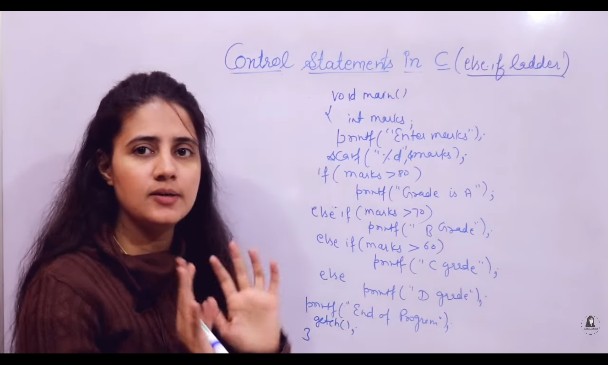
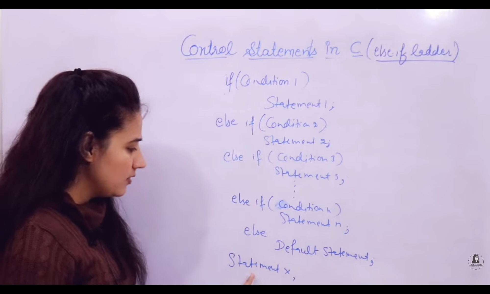

## COntrol Statements

### if
- int a;
- if(a=0){
- printf("Devanshu"); | o?p : Program did not output anything!

- int a;
- if(a=25){
- printf("Devanshu"); | o/p: Devanshu

---

---

### Else if Ladder
- In `Else if` ladder, `else` statement is `not mandatory`

