## LOOPS

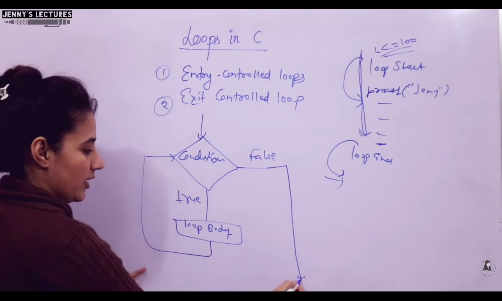

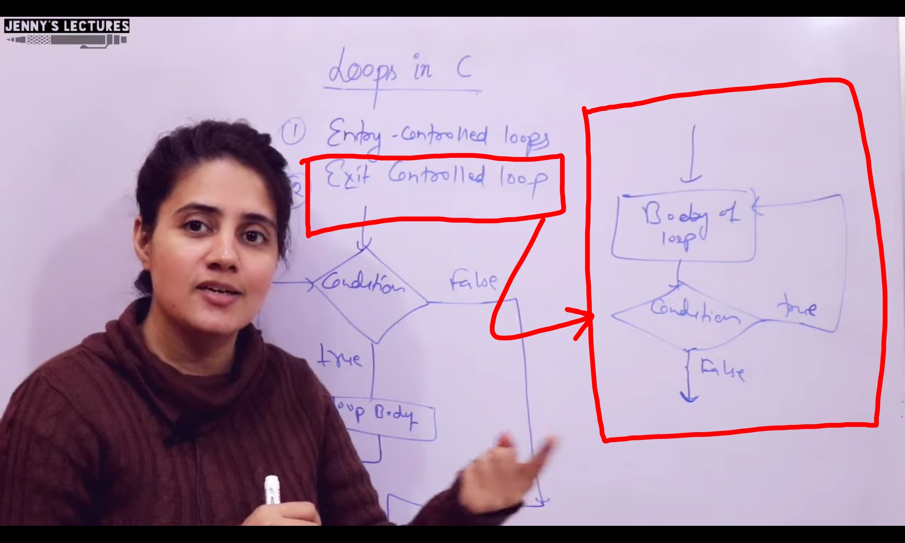

---
### Initialisation

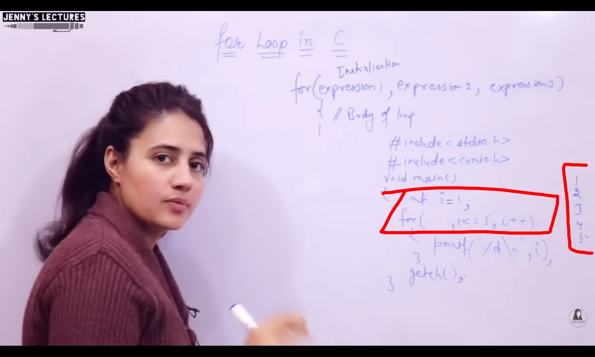

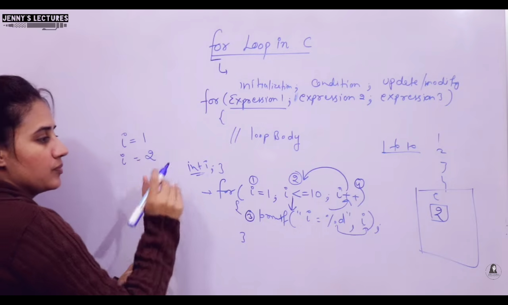
---
### Not initialsed so NO output

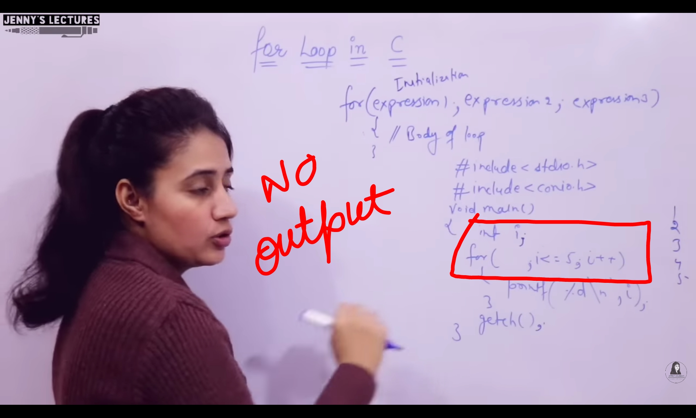

---
### No Termination 

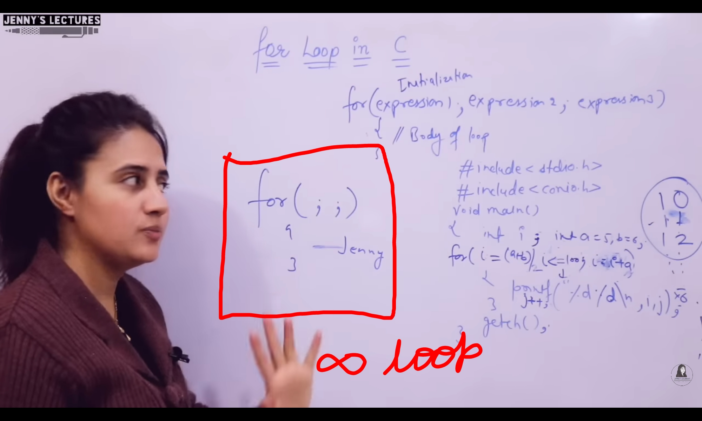

---
### Logical Expressions can also be used via multiple variables

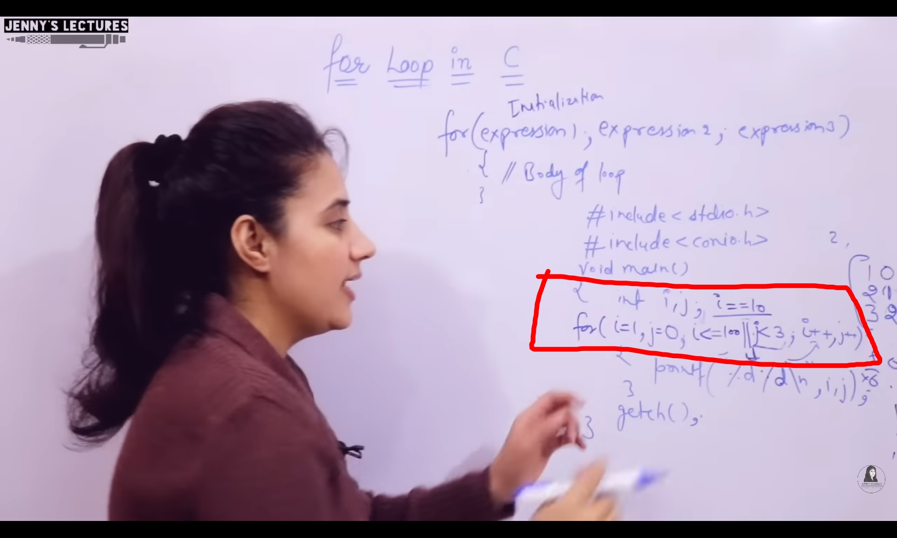

---
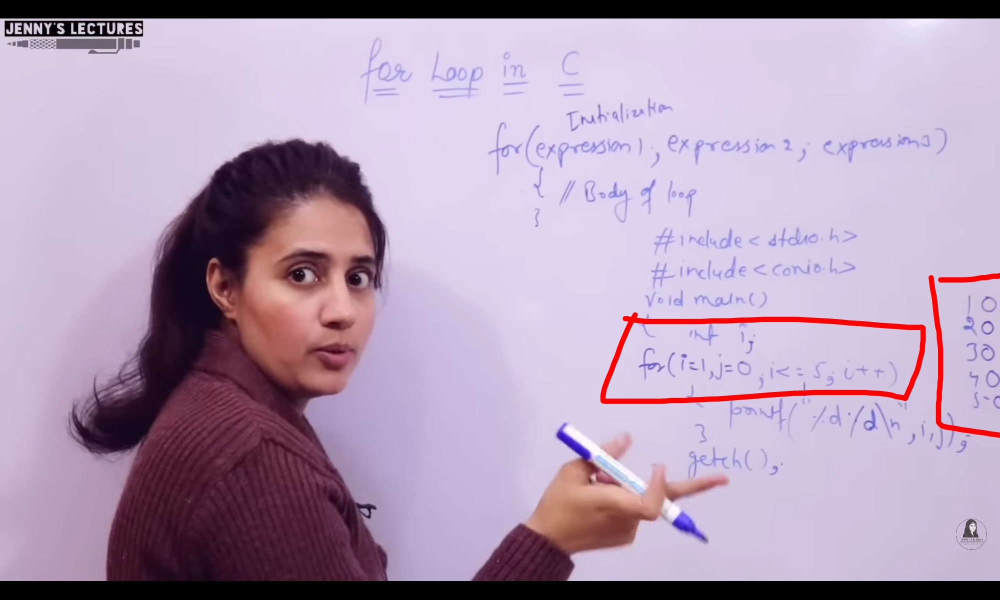

---
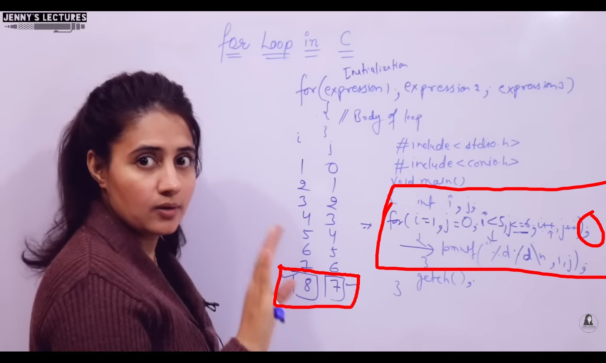

---
### Only `Last` Termination condition is taken seriously

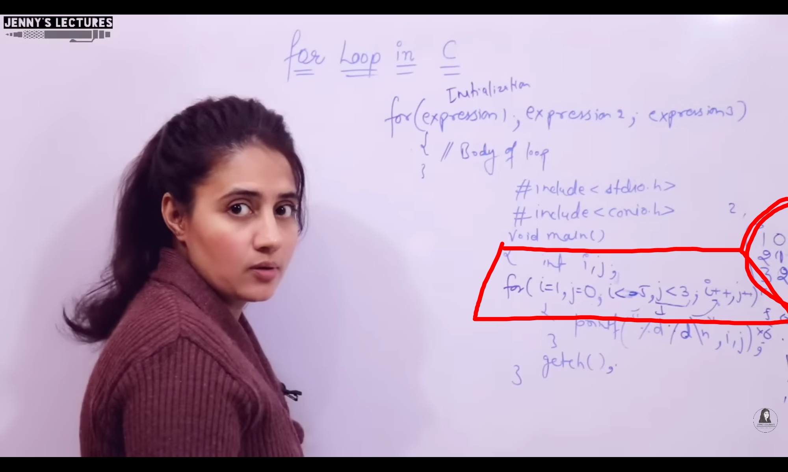

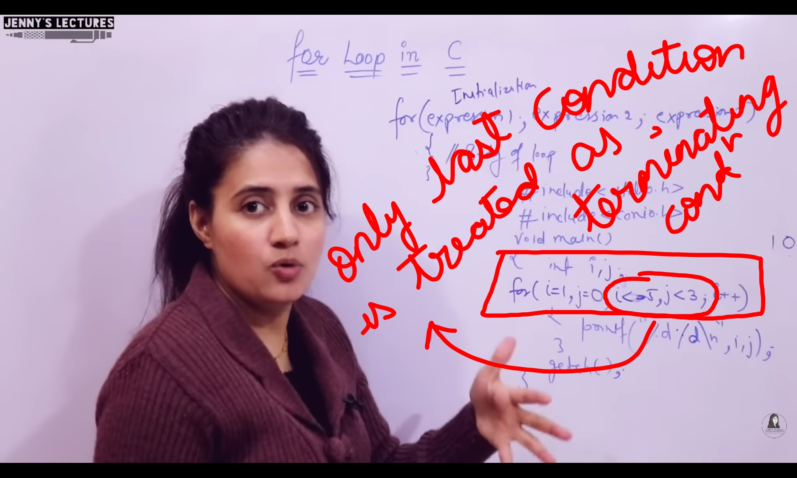

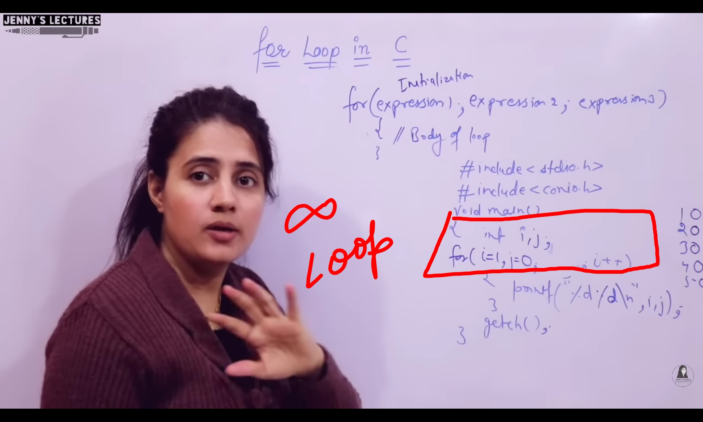

