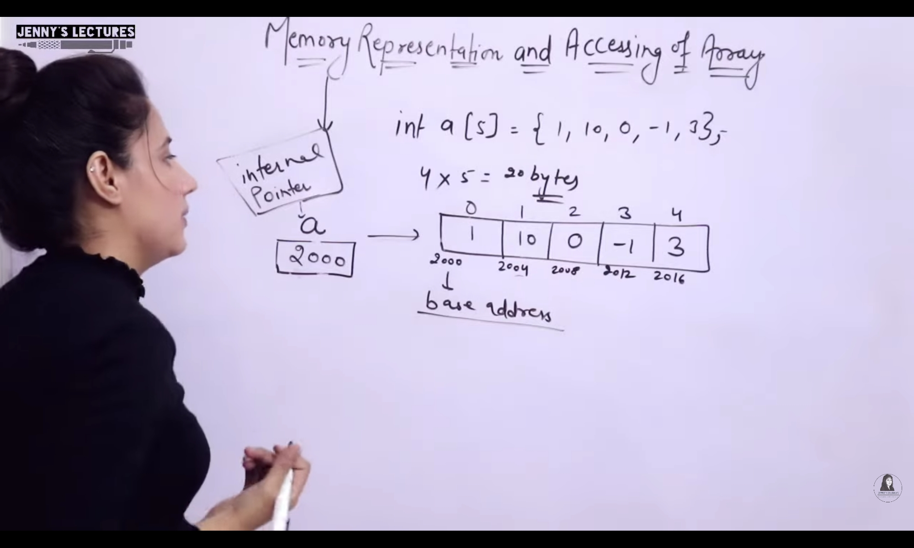
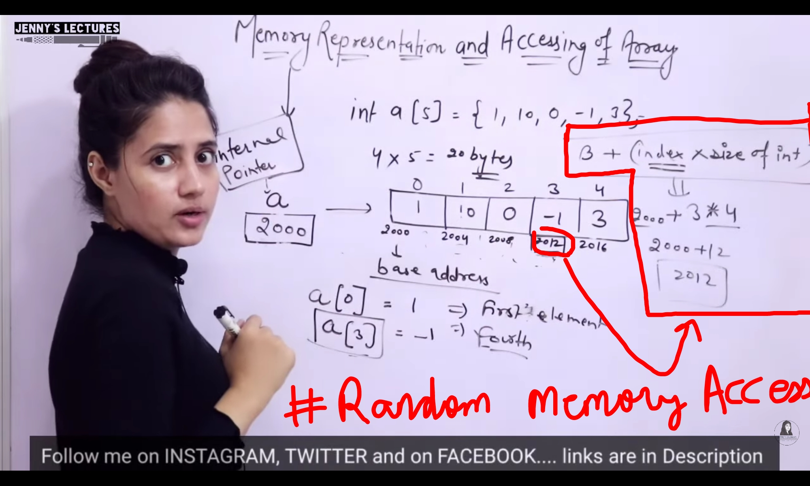

## Arrays

- `int a[60]`: Declaration
    - `a `: Name of array 
    - `60` : Size of array
    - `int` : Datatype of array
    - `Total memory` : 60*4 = 240bytes
    - `Consecutive memory allocation`
    - `Defintion` : Collection of more than one homogeneous items

- `int a[]; `
    - Error
    - Because size not specified
    - `Size` should be positive integral value
    - `int a[5.5]` is okay, will be equal to `int a[5]`
    - `int a[b = 5.5]` : Works fine, array of size 5. But illegal to use, coz might generate error of stack overflow or underflow

---

### Arrays
- Arrays can be initialised during
    - ### `Compile Time`
        - When we declare the array, at that time only we initialise the array
        - int a[5] : Declaration
        - int a[5] = {1,2,3,4,5} : Initialisation
        - `int a[]  = {1,2,3,4,5} : Initialisation `
        - int a[5] = {0,1,-1} = {0,1,-1,0,0}
            - Others will be initialised with 0
        - int a[5]; 
            - Array is holding Garbage value not necessary 0
        - int a[5] = {1,2,3,4,5,6,7};
            - Error
        - int a[5];
            - a[0] = 10;
            - a[1] = 1;
            - a[2] = 2;
            - a[3] = 3;
            - a[4] = 4;
        - int a[5] = {};
            - Error
        - `char b[] = {'D' , 'e' , 'v' , 'u' }`
        - `char b[10] = {'D', 'e', 'v', 'u'};`
            - Other values will be initialised with `NULL` 
        
    - ### `Run Time`
        - int a[5];
            - for(int i=0; i<5; i++){
                scanf("%d", &a[i]);
            }

---

### Memory Representation & Accessing in Array

    

    