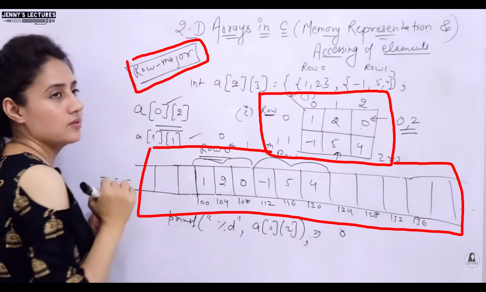
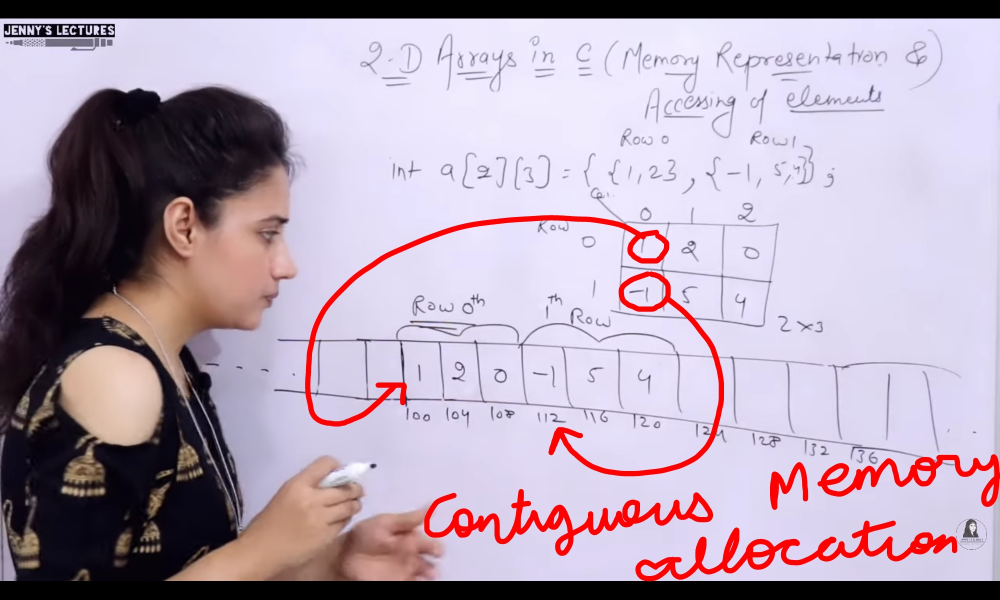
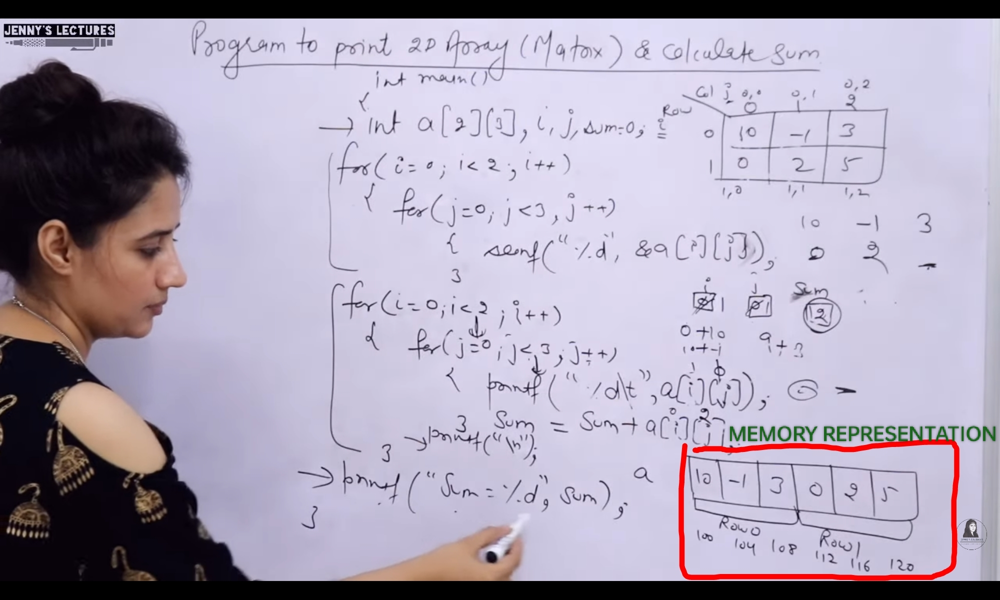

## 2-D Arrays
- `int marks[rows][columns]` : Declarations
    - `int marks[5][60]` : 5 subjects, 60 students
- 2-D arrays are lso known as `Matrix`
- `Size` of 2-D Array : `rows*columns`
- Total memory allocation = (size)*(sizeof_Datatype)

--- 
## Initialisation of 2-D Arrays
- ### `At Compile Time`
    - `int a[2][3] = {1,1,1,2,2,2}`
        - Memory Representation 
            - 1 1 1
            - 2 2 2
    - `int a[2][3] = {{1,1,1}, {2,2,2}}`
        - Memory Representation 
            - 1 1 1
            - 2 2 2
    - `int a[][3] = {1,1,1,2,2,2}`
        - When initialised, it is not compulsory to give `row size`
    - `int a[2][3] = {0}`
        - Memory Representation 
            - 0 0 0 
            - 0 0 0
    - `int a[2][3] = {0,0,1,1}`
        - Memory Representation 
            - 0 0 1
            - 1 0 0
    - `int a[2][3] = {{0,0},{1,1}}`
        - Memory Representation 
            - 0 0 0
            - 1 1 0
    - `int a[][3] = {0}`
        - Only Single Row
        - Memory Representation 
            - 0 0 0
    - `int a[][3] = {1,1,1,2}`
        - Memory Representation 
            - 1 1 1
            - 2 0 0
    
- ### `Runtime Initialisation`
    - int a[2][3]
        - for(int i=0; i<rows; i++){
            for(int j=0; j<columns; j++){
                scanf("%d", &a[i][j]);
            }
        }

---
## Accessing and Memory Representation

