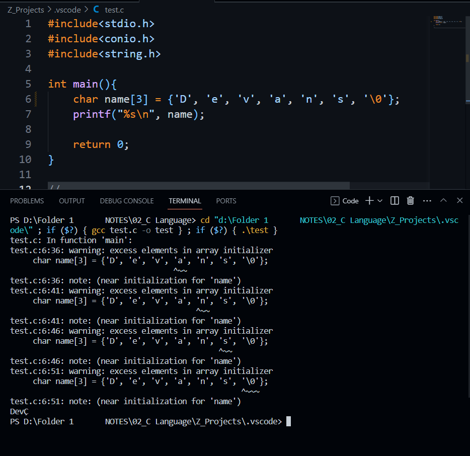
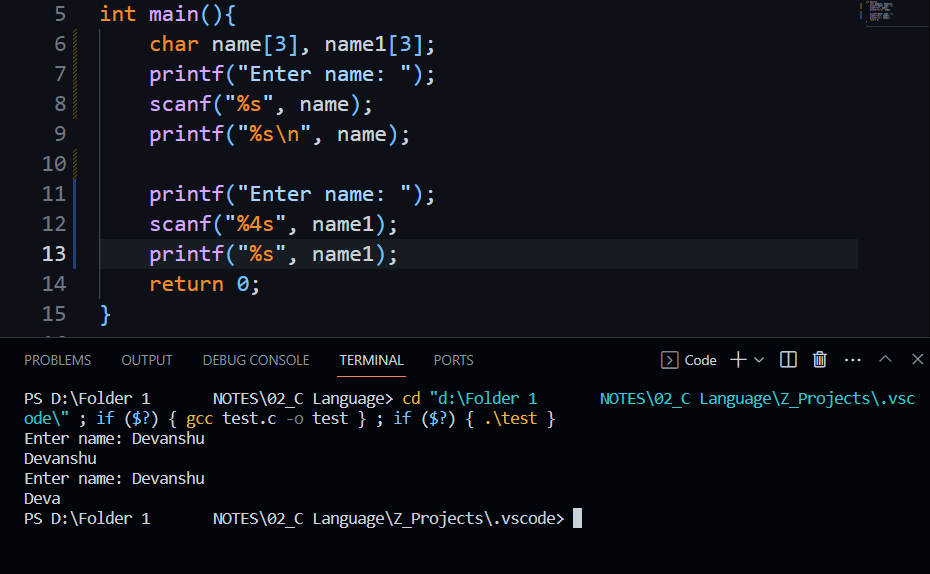
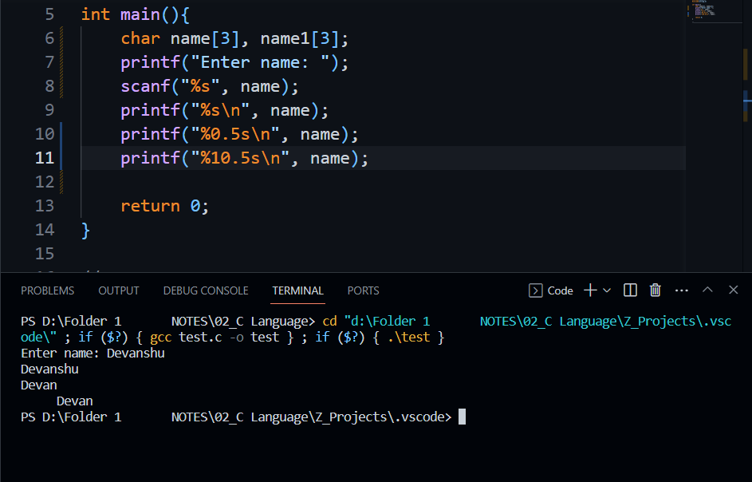

## Strings
- `Null terminated array of characters`
- char stringName[20];
    - 20 : Size / Number of Elements
- `stringName` consists the `base address` of first indexed element
- Strings `ends` with `Null character`
- `%s : Format Specifier`
    - Although, string is not a datatype in C, but it has its format specifier
    - printf("%s", stringName)
        - No need of loop, format specifier, outputs all the characters 

---
## Initialisation
- `char stringName[12] = "Devanshu"`
- stringName = |D|e|v|a|n|s|h|u|\0| | | |
    - String ends with Null character
    - The rest blocks after NULL contains garbage value
- `char stringName[] = "Devanshu"`
- `char name[12] = {'D', 'e', 'v', 'a', 'n', 's', 'h', 'u', '\0'}`
- `char lName[] = {'J', 'a', 'i', 'n', '\0'}`
- `While writing as characters in an array, it is mandatory to terminate it with Null Character  `
    - char name[] = {'J', 'a', 'i', 'n', '\0'};
- `While writing it as string, it is not necessary`
    - char name1[] = "Debu";
- The size we take while initialisation, `name[size]` is to be taken `1 more` than inputted number of characters, to `accomodate Null Character`

- char act[] = {'w', 'e', ' ', 'r', 'o', 'c', 'k', '\0'} 
    - `act = |w|e| |r|o|c|k|\0|`
- `Not Allowed - 1`
    - char name[10];
    - name = {'D', 'e', 'v', 'a'};

- `Not Allowed - 2`
    - char name[] = {'D', 'e', 'v', 'a', '\0'};
    - char s2[10];
    - s2 = "devanshu";

- `Not Allowed - 3`
    - The size we enter while declaration, will be characters buffer will hold for that variable
    

- `Not Allowed - 4`
    - char name[6] = "Hello";
    - printf("%s\n", name);
    - o/p : Hello

- `Not Allowed - 5`
    - char name[5] = "Hello";
    - printf("%s\n", name);
    - o/p : HelloC` | Garbage character terminated

---
## Runtime Initialisation
- `scnaf()`
    - scanf("%s", name)  | `No &name`
- `gets()`
- `Character Array vs String`
    - char s1[10]= "Deva";
    - Character Array = |D|e|v|a|\0|G1|G2|G3|G4|G5 -> G: Garbage Value
    - String = |D|e|v|a|\0|
- `Buffer Overflow` : Over-writing the unallocated memory contiguous to allocated memory
    - `Buffer Overflow happens at Runtime Initialisation, and happens due to scanf and gets`
    - char name[3];
    - scanf("%s", name);  | Devanshu
    - printf("%s", name); |Devanshu | No garbage

- `scanf does not take complete line with whitespaces`
    - scanf("Devanshu Jain")  | Devanshu

---
## FieldWidth

---
## puts
- Adds a new line by default after printing
- `puts` is defined in `stdio` library
- `printf("%s", name)` = `printf("%s", &name)` = `printf("%s", &name[0])`
- `printf("%s", &name[3])` | i/p : Devanshu | o/p : anshu

