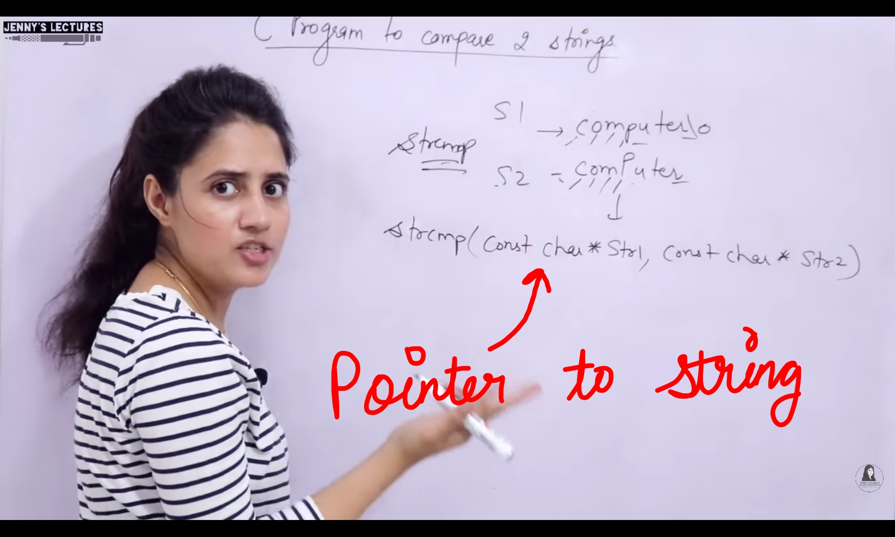
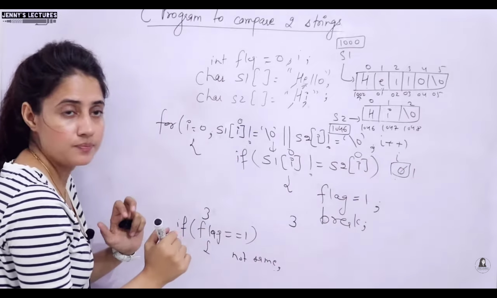
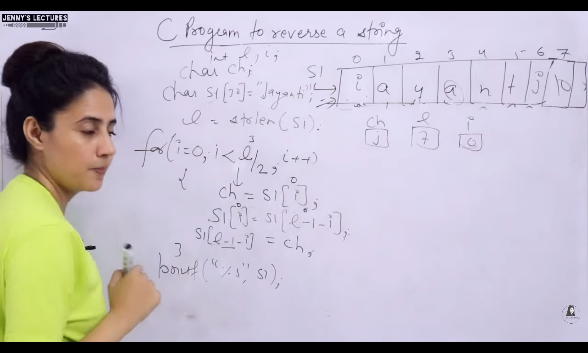

## Standard Functions
- `strlen(name)` : Returns Length of String, Always Positive
    - `Null Character` is not included in length of string
- `strcat(s1, s2)` : 
    - Changes original string, 
    - Does not return anything
    - s1 is resultant string, 
    - s1 = destintation where to append, 
    - s2 = soure to append
    - Does not change s2
- `strcat(s1, "Jain")` : Can concat, strings this way too 
- `strncat(s1,s2,4)` : 4 characters to be appended of s2 in s1
- `strcmp(s1, s2) : `
    - Returns an integer value
    - 0 : If both strings are same
    - Positive : If ASCII of Unmatched chracter in 1st String is `higher` than that of 2nd
    - Negative : If ASCII of Unmatched chracter in 1st String is `lower` than that of 2nd
- `strrev(name)`: 
    - Changes original string
    - Reverses the string
- `strlwr(s1)` : 
    - Changes original String
    - Only changes the Alphabets and no other special characters
- `strupr(s1)` : 
    - Changes original String
    - Only changes the Alphabets and no other special characters

---
### Length of String
  

---
### Concatenation of Strings
    

--- 
### Comparison of Strings
       

---
### Reversal of String
 

---
### Upper to Lower and Vice Versa
 